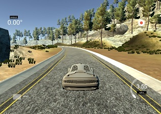

#**Behavioral Cloning Project**

[](http://www.udacity.com/drive)

Overview
---
This repository contains the work I did within **Project #3 of Udacity's Self-Driving Car Nanodegree Program**. Objective of the project is to learn a car to drive on a simulator track, using a deep-learning approach. For this Udacity provides us with a car driving simulator it has developed.

*Snapshot of Udacity's driving simulator*




Project objectives and steps
---


* Use the simulator to collect data of good driving behavior
* Build, a convolution neural network in Keras that predicts steering angles from images
* Train and validate the model with a training and validation set
* Test that the model successfully drives around track one without leaving the road
* Summarize the results with a written report


Repository content
---
The repository includes the following files:

* _model.py_ : script to create and train the CNN
* _drive.py_ : script for driving the car in autonomous mode
* _model.h5_ : model of the trained convolution neural network 
* _writeup\_report.md_ : report of the work done

And two directories:

* _/images_: images used within the markdown files
* _/videos_: videos of the car driving during training and autonomous modes

Using the Udacity provided simulator and the _drive.py_ file, the car can be driven autonomously around the track by executing: 
```
python drive.py model.h5
```

Dependencies
---
This lab requires the [CarND Term1 Starter Kit](https://github.com/udacity/CarND-Term1-Starter-Kit).

The lab environment can be created with CarND Term1 Starter Kit. Click [here](https://github.com/udacity/CarND-Term1-Starter-Kit/blob/master/README.md) for the details.


