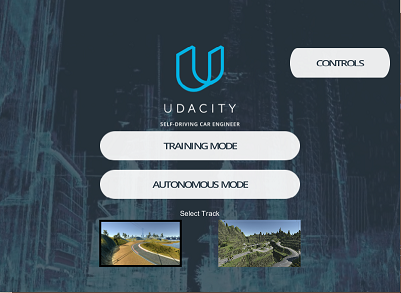
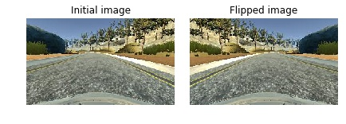
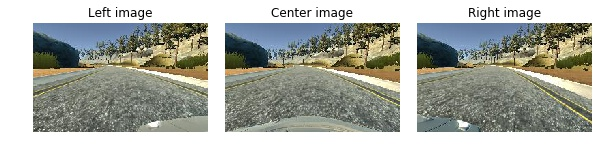
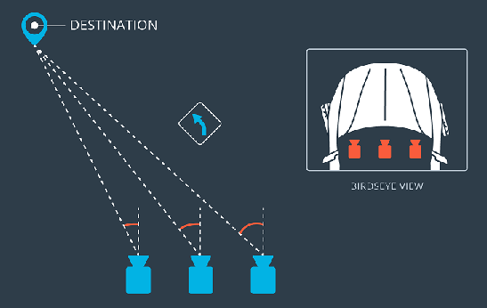
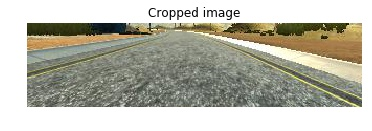
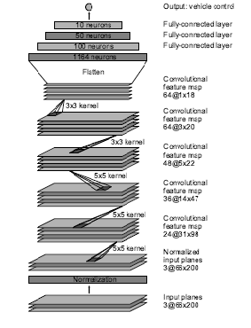
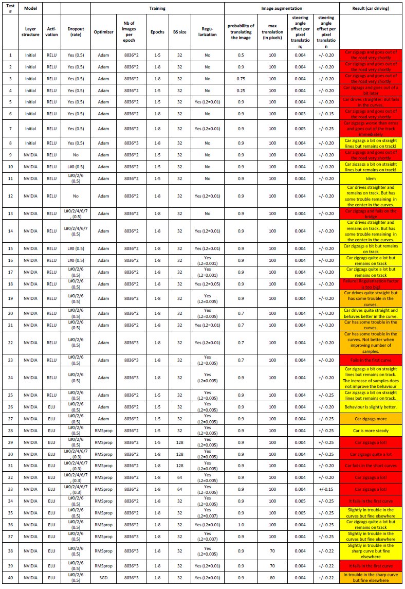
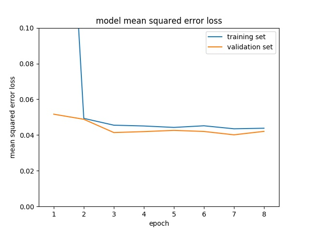

#**Behavioral Cloning Project** 

---

## Presentation of the project

This document sums up the work I did within Project #3 of Udacity's Self-Driving Car Nanodegree Program.
Objective of the project is to learn a car to drive on a simulator track, using a deep-learning approach.
For this Udacity provides us with a car driving simulator it has developed.

Learning the car to drive is done through the following steps:

* Use the simulator to collect data of good driving behavior
* Build, a convolution neural network in Keras that predicts steering angles from images
* Train and validate the model with a training and validation set
* Test that the model successfully drives around the track without leaving the road

## Table of content
[TOC]

## Simulator

Udacity's simulator can be downloaded [here](https://d17h27t6h515a5.cloudfront.net/topher/2017/February/58ae4419_windows-sim/windows-sim.zip).

Upon opening it, we can select:

* training or autonomous mode,
* the track (easy/difficult).

.

Below is a screenshot of the simulator taken on the first track. The steering angle is displayed in the upper left corner.

.

The car can be steered either with the keyboard or with the mouse. The second way  
appears to be better for having a smooth drive. However it is still very difficult to have the car move smoothly in the middle of the road. For sure it would be better with a joystick.

Fortunately Udacity has a generated a dataset from the simulator which we car use to learn the car to drive properly. 

##Solution Design Approach

It turned out to be very difficult to generate a nice training data set with the simulator. Having the car drive straight in the middle of the road is very difficult with the keyboard or mouse. As a consequence, I decided  to use the data set provided by udacity to set up my model.

I then augmented it using the ideas which were provided in Udacity class.

Then I developed my neural network with Keras. As a starting point I decided to use a convolution neural network model similar to the one I developped for the traffic sign classifier (Project #2). It had provided really good accuracy even without data augmentation. Thus I was curious to see how it would behave for this new task. I just made slight changes to adapt it to this new problem:
 
* modification of the first layer to take the 3 colour channels into account (I used only grayscale images for traffic sign classification project)
* modification of the last layer to yield only one output (corresponding to the steering channel).
* modification of the objective function: rms loss instead of cross-entropy as we are now facing a regression problem (previous project was a classification project). 

There were several hyperparameters to tune so I trained my neural network for a bunch of configurations. Training was done on a GPU instance on AWS. Each training takes about 5 minutes.

The final step was then to run the simulator to see how well the car was driving around track one. The car turned out to zigzag a lot. It managed to achieve a full lap only for one of the configurations.

Thus I decided to complexify my model. Udacity provided us with a [paper](https://arxiv.org/abs/1604.07316) describing the neural network architecture that NVIDIA team developed for its self driving car. I then implemented this architecture to see how better it would perform. The input size being different I had to make minor changes. I also tested the impact of dropout and regularization.

After model improvement, the vehicle was able to drive autonomously around the track without leaving the road. However it is zigzaging in some turns. Actually this is because the training set which is provided by Udacity contains several situations where the car zigzags. Thus the car has learnt to zigzag in some situations! 

Recordings of the car driving a full lap on the first track can be found in the directory [./Videos]().
There are two recordings corresponding to driving in normal and reverse ways.

I also tried to test the behaviour on the second track. However it was a complete miss...

## Solution detail 
###Data Set

As I mentioned before I decided to use Udacity's image set. It contains 8036 sets of 3 images. Indeed the car has three cameras (left, center, right) so for each recording we get 3 images. Overall this amounts to more than 24000 images.
I made a video of the training set, using onlyt the center camera image. It can be found in the [./Videos]() directory. We see that the training consisted in several laps in normal and reverse directions. We also can notice that the car has not a perfect straight driving!

### Data augmentation
**Augmenting the data set provides a more comprehensive set of images and enables the model to better generalize.**

To augment the data set, I implemented three methods which are described hereafter.

####Image flipping
I randomly (with a probability of 0.5) flipped images (and steering angle): it prevents the neural network output from being biased as there are more left turns than right turns (track #1 is counter clockwise). 
	For example, below we plot an image after flipping:


 
####Using left/right cameras
Using images from the left and right cameras enables to simulate different vehicle positions on the road and generate additional training data to simulate recovery. This approach is used by NVIDIA.

Below are examples of left, center and right camera images:


	

 Steering angles have to be defined for the left and right images. We take the steering angle from the center image to which we add (subtract) a positive bias for the left (right image). Indeed for example, when the car is turning left (negative steering angle) the left image represents what a car on the left side of the road would see. Then the steering angle (in absolute value) has to be reduced, that is a positive bias has to be added. This is the opposite for the right image. The picture, taken from Udacity class material, is a good way to represent it:



I tested several offset values ranging from 0.15 to 0.25.

####Translating images
To simulate additional vehicle positions on the road I randomly translated input images. Actually I only translated images whose associated steering command was near zero (including also left and right images). Indeed input set contains a vast majority of steering command close to zero as most of the time the car is driving straight in the middle of the lane. The picture below represents a distribution of the steering commands.


Three parameters come into play in the image translation:

* probability of translating the image: I tested values from 0.5 to 1
* maximum translation in pixels: I tested values ranging from 70 to 100 pixels
* steering command offet per pixel: I tested values from 0.003 to 0.005

The figures below represent the histrogram of steering commands after random translation for the following parameters: 

* steering angle offset for left/right cameras: +/-0.20
* proba of translation: 0.8
* max pixel translation: 100
* steering angle offset per pixel: 0.004

We distinguish the 3 peaks at -0.2 / 0 / 0.2.


###Data preprocessing

The following image preprocessing is applied:

* converting the input format from BGR to RGB. This is necessary as the function `cv2.imread`, which we use to read images, provides BGR format while for car driving evaluation (cf. script ```drive.py```), images are yielded in RBG format.

```image = cv2.cvtColor(image, cv2.COLOR_BGR2RGB)```

* normalizing the image so as to get values between -0.5 and 0.5
This is done with Keras, using a Lambda layer (this enables to create arbitrary functions that operate on each image as it passes through the layer):

```	model.add(Lambda (lambda x: (x/255.0-0.5),input_shape=(160,320,3)))```


* cropping the picture. Indeed not all of the image pixels contain useful information. The top portion of the image captures landscape and sky, and the bottom portion of the image captures the hood of the car. We will then remove the top 55 pixels and the 25 bottom pixels. This is done with Keras which offers a cropping layer which is very fast on a GPU, because it works in parallel.

```model.add(Cropping2D(cropping=((55, 25), (0, 0)))```

Below we plot an example after cropping.


### Training
#### Data generator
Data augmentation creates a tremendous amount of data and it turns out to be impossible to store all the data in memory and then process it. 

To overcome this problem we make use of Keras generators. Instead of storing the data in memory all at once, we generate it piece by piece and process it on the fly, which is much more memory-efficient. Image augmentation is thus done by the generator. As mentioned before image preprocessing is done through model layers.

#### Optimizer
I tested three different optimizers : SGD, RMSprop and Adam. I kept the default parameters values. They are recalled hereafter:

* ```SGD(lr=0.01, momentum=0.0, decay=0.0, nesterov=False)```
* ```RMSprop(lr=0.001, rho=0.9, epsilon=1e-08, decay=0.0)```
* ```Adam(lr=0.001, beta_1=0.9, beta_2=0.999, epsilon=1e-08, decay=0.0)```
 
#### Loss
 Mean Square Error.
 L2-regularization was applied on certain configurations.

#### Hyperparameters
* Number of epochs: {8}. I saved the model at the end of each epoch so as to finally use the one with the lowest loss. This is done with the Callback `ModelCheckpoint`.
* Batch size: {32, 64, 128}
* Regularization factor: {0.001, 0.005, 0.007, 0.01}
* Number of samples: {16072 / 24108}

**20%** of the data set is used for model evaluation at the end of each epoch.

### Model architecture
####Initial model
The Keras implementation of my first model (adapted from project #2) is shown below:

	model = Sequential()
	model.add(Lambda (lambda x: (x/255.0-0.5),input_shape=(160,320,3))) # normalisation
	model.add(Cropping2D(cropping=((55, 25), (0, 0))))
	model.add(Conv2D(16,5,5,activation='relu'))
	model.add(Conv2D(32,5,5,activation='relu'))
	model.add(MaxPooling2D())
	model.add(Conv2D(64,5,5,activation='relu'))
	model.add(MaxPooling2D())
	model.add(Flatten())
	model.add(Dropout(do_rate))
	model.add(Dense(120,activation='relu'))
	model.add(Dropout(do_rate))
	model.add(Dense(80,activation='relu'))
	model.add(Dropout(do_rate))
	model.add(Dense(1))
	
My model consists in a CNN with 5x5 filter sizes and  successive depths of 16, 32 and 64, with maxpooling on the second and third convolutional layers. It is followed by a fully connected network (3 layers) with 120, 80 and 1 output.
The model includes RELU layers to introduce nonlinearity. 
The model contains 3 dropout layers in order to reduce overfitting . 

#### NVIDIA's Architecture
Architecture of NVIDIA's CNN is represented below (image taken from their paper). It is composed of 5 convolutional layers, followed by 3 fully connected layers. They use strided convolutions in the first three convolutional layers with a 2x2 stride and a 5x5 kernel and a non-strided convolution with a 3x3 kernel size in the last two convolution layers.



The input size being different in our case, I changed the kernel in the 4th convolutional layer to be 5x5.
In NVIDIA's paper there was no information on the activation function, nor if they were using dropout, regularization.
I then tried different configurations:

 - activation: RELU / ELU
 - dropout: 
	 - no dropout
	 - dropout on input data
	 - dropout on input data, plus after layers #2 and #6
	 - dropout on input data, plus after layers #2, #4, #6, #7
 - dropout rate: 0.3 / 0.5
 		
An example of NVIDIA model implementation in Keras is the following:

    model = Sequential()
    model.add(Lambda (lambda x: (x/255.0-0.5),input_shape=(160,320,3))) # normalisation
    model.add(Cropping2D(cropping=((55, 25), (0, 0)))) # 0 - (80, 320, 3)
    model.add(Dropout(do_rate))
    model.add(Conv2D(24,5,5,subsample=(2,2),activation='elu', W_regularizer=l2(l_reg))) # 1 - (38, 158, 24)
    model.add(Conv2D(36,5,5,subsample=(2,2),activation='elu', W_regularizer=l2(l_reg))) # 2 - (17, 77, 36)
    model.add(Dropout(do_rate))
    model.add(Conv2D(48,5,5,subsample=(2,2),activation='elu', W_regularizer=l2(l_reg))) # 3 - (17, 77, 36)
    model.add(Conv2D(64,5,5,activation='elu', W_regularizer=l2(l_reg))) # 4
    model.add(Conv2D(64,3,3,activation='elu', W_regularizer=l2(l_reg))) # 5
    model.add(Flatten())
    model.add(Dense(100,activation='elu', W_regularizer=l2(l_reg))) # 6
    model.add(Dropout(do_rate))
    model.add(Dense(50,activation='elu', W_regularizer=l2(l_reg))) # 7
    model.add(Dense(10,activation='elu', W_regularizer=l2(l_reg))) # 8
    model.add(Dense(1))


### Model evaluation
#### Test list
All the configurations which were tested are listed in the table below. The last column indicates the result of the driving evaluation. I added a colour code to ease behaviour assessment.

 - green: perfect behaviour (car succeeds in driving a lap with smoothed centered trajectory) 
 - yellow: acceptable behaviour (car succeeds in driving a lap but trajectory is not completely smooth)
 - orange:  not acceptable behaviour (car succeeds in driving a lap but car doesn't drive straight at all)
 - red: car fails to finish a lap

As we can see, no configuration ended up with green colour. Indeed as you may see in the video, although the car achieves to drive around the first track without touching the borders, it is not always centered in the middle of the lane, and zigzags for certain situations.

**List of all training configurations with associated results:**


#### Results and analysis
The main observations I made are the following:

* Model : 
	* Architecture: NVIDIA model behaves far better than my initial model. However I still could find a configuration where my initial model could perform a full lap. This means that the complexity of NVIDIA's model is not necessary to achieve this project. However for successful driving in many different situations, this level of complexity seems mandatory
	* Dropout: adding dropout layers increase the behaviour. However it is not necessary to add a lot of them. **Only one dropout layer on the inputs provided as good results as adding 5 dropout layers**.
	* Activation: no noticeable difference between RELU and ELU.
* Image augmentation:
	* The best choice for the probability of translating images with near-zero steering angle was 0.9. That is we only keep 10% of straight driving images.
	* Steering angle offset for left/right images between 0.20 and 0.25 appear fine
	* Maximum translation : no big difference from 70 to 100 pixels
	* Steering angle offset per pixel when translating the image: 0.004 was better than 0.005. This latter figure results in more zigzaging of the car
* Training:
	* Number of samples: increasing from 16000 to 24000 points brought very little improvements
	* Nb of epochs: the optimization converged very quickly. After 3 epochs, the loss was almost stabilized. We can see it on the picture at the end of this paragraph.
	* Regularization: helps the car to drive straighter. The best values were between 0.005 and 0.01, and depended on other parameters. The higher the value the straigher drives the car, but the risk of going out in the curves increases!
	* Batch size: 32 was the best choice. Surprisingly I got really bad results with 128.
	* Optimizer: no noticeable differnece between Adam, RMSprop and SGD, at least for with the default values. Certainly tuning the hyperparameters could bring differences.



The video recordings of the car driving autonomously were obtained with configurations #28.
The configuration is the following:

* model=NVIDIA
* activation = ELU
* dropout after layers #0/2/6, dropout rate = 0.5
* loss function = RMSprop; with L2 regularization (factor = 0.005)
* nb of samples for training: 16072
* epochs = 5
* batch size =	32	
* probability of translating the image = 0.9
* max translation (in pixels) = 100
* steering angle offset per pixel translation = 0.004
* steering angle offset left/right images =	+/- 0.25

## References
Below is a list of references that were wisely used to achieve this project.

Useful hints from previous Udacity students:

* [An augmentation based deep neural network approach to learn human driving behavior](https://chatbotslife.com/using-augmentation-to-mimic-human-driving-496b569760a9)
* [Teaching a car to drive itself](https://chatbotslife.com/teaching-a-car-to-drive-himself-e9a2966571c5)

Model architecture

* [End to End Learning for Self-Driving Cars - NVIDIA ](https://arxiv.org/abs/1604.07316)

Dropout 

* [Dropout Regularization in Deep Learning Models With Keras](http://machinelearningmastery.com/dropout-regularization-deep-learning-models-keras/)


